# Do Inpainting Yourself: Generative Facial Inpainting Guided by Exemplars (EXE-GAN)
Official PyTorch implementation of EXE-GAN.
[[Homepage]](https://longlongaaago.github.io/EXE-GAN/)

<div style="text-align: justify"> We present EXE-GAN, a novel exemplar-guided facial inpainting framework using generative adversarial networks. Our
approach can not only preserve the quality of the input facial image but also complete the image with exemplar-like facial attributes.</div>

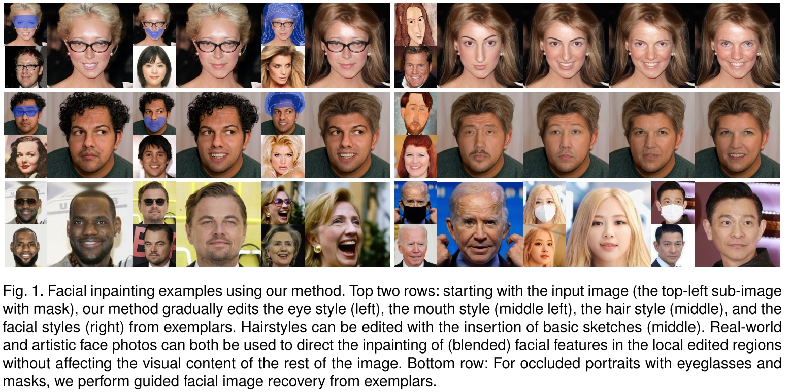


## Notice
Our paper was first released at Sun, 13 Feb 2022. 
We are thankful for the community's recognition and attention to our project.
Due to a lengthy review process, there has been a delay in sharing our codes. 
Now, we are excited to open-source our work on GitHub. 
We also recognized that there have been some great papers published after ours,
and we encourage you to check out their projects as well:
- [Paint by Example](https://arxiv.org/abs/2211.13227), [codes](https://github.com/Fantasy-Studio/Paint-by-Example) (released at Wed, 23 Nov 2022, CVPR 2023 )
- [Reference-Guided Face Inpainting](https://arxiv.org/abs/2303.07014), [codes](https://github.com/wuyangluo/reffaceinpainting) (released at Mon, 13 Mar 2023, TCSVT 2023)
- [PATMAT](https://arxiv.org/abs/2304.06107), [codes](https://github.com/humansensinglab/PATMAT) (released at Wed, 12 Apr 2023, ICCV 2023)

## Requirements 
```
cd EXE-GAN project
pip install -r requirements.txt
```
- Note that other versions of PyTorch (e.g., higher than 1.7) also work well, but you have to install the corresponding CUDA version. 

##### What we have released
- [x] Training and testing codes
- [x] Pre-trained models

## Training
- Prepare your dataset - The folder structure of training and testing data are shown below:  
```
root/
    test/
        xxx.png
        ...
        xxz.png
    train/
        xxx.png
        ...
        xxz.png
```
- Prepare pre-trained checkpoints:
[Arcface.pth](https://drive.google.com/file/d/18w_YKb0cLX6LAdY4008vEgCPD-_3RmRE/view?usp=drive_link) and 
[psp_ffhq_encode.pt](https://drive.google.com/file/d/1_GdbsT1A5dyxF0FqOEiFlmouVsyf7Ag1/view?usp=drive_link) (put models in ./pre-train)


- Training
> python train.py --path /root/train --test_path /root/test
--size 256 --embedding_weight 0.1 --id_loss_weight 0.1 --percept_loss_weight 0.5 --arcface_path ./pre-train/Arcface.pth
--psp_checkpoint_path ./pre-train/psp_ffhq_encode.pt

## Testing 
(use our pre-trained model [EXE_GAN_model.pt](https://drive.google.com/file/d/1y7ThKBXL7QK7CPtvT3KICeNOu1T2xlCA/view?usp=drive_link) or trained *pt file by yourself.)
> python test.py --path /root/test  --size 256 --psp_checkpoint_path ./pre-train/psp_ffhq_encode.pt --ckpt ./checkpoint/EXE_GAN_model.pt


## Exemplar guided facial image recovery 
(use our pre-trained model [EXE_GAN_model.pt](https://drive.google.com/file/d/1y7ThKBXL7QK7CPtvT3KICeNOu1T2xlCA/view?usp=drive_link) or trained *pt file by yourself.)
> python guided_recovery.py --psp_checkpoint_path ./pre-train/psp_ffhq_encode.pt
--ckpt  ./checkpoint/EXE_GAN_model.pt  --masked_dir ./imgs/exe_guided_recovery/mask --gt_dir ./imgs/exe_guided_recovery/target --exemplar_dir ./imgs/exe_guided_recovery/exemplar --sample_times 10  

|  | 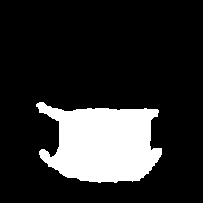 |  | |
| :----------------------------------------------------------: | :----------------------------------------------------------: | :----------------------------------------------------------: |:----------------------------------------------------------: |
|  |  |  | |
| 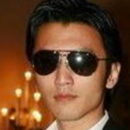 | 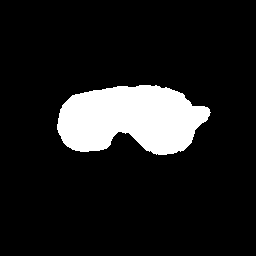 |  |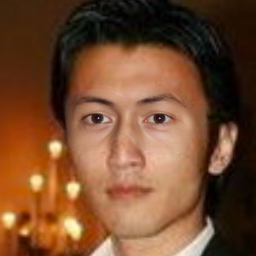 |
|  | 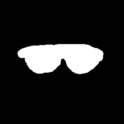 |  | |
|          Ground-truth                        |                      Mask                               | Exemplar       | Inpainted  | 

- Inherent diversity--set ``--sample_times 10``  higher to get more diverse results.

|  |  |  | |
| :----------------------------------------------------------: | :----------------------------------------------------------: | :----------------------------------------------------------: |:----------------------------------------------------------: |
|          diversity 1                       |                      diversity 2                               | diversity 3       | diversity 4  | 


## Exemplar guided style mixing 
(use our pre-trained model [EXE_GAN_model.pt](https://drive.google.com/file/d/1y7ThKBXL7QK7CPtvT3KICeNOu1T2xlCA/view?usp=drive_link) or trained *pt file by yourself.)
> python guided_recovery.py --psp_checkpoint_path ./pre-train/psp_ffhq_encode.pt
--ckpt  ./checkpoint/EXE_GAN_model.pt  --masked_dir ./imgs/exe_guided_recovery/mask --gt_dir ./imgs/exe_guided_recovery/target --exemplar_dir ./imgs/exe_guided_recovery/exemplar --sample_times 2  

| 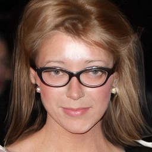 | 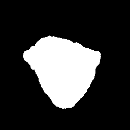 |  | |
| :----------------------------------------------------------: | :----------------------------------------------------------: | :----------------------------------------------------------: |:----------------------------------------------------------: |
|         Ground-truth                      |                      Mask                              | Exemplar 1       | Exemplar 2  | 

- style mixing results

|  |  |  |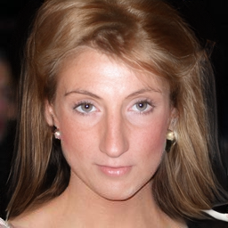 |
| :----------------------------------------------------------: | :----------------------------------------------------------: | :----------------------------------------------------------: |:----------------------------------------------------------: |
|  |  |  | |
|  | 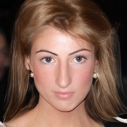 |  |  |
|  |  | 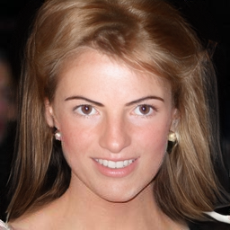 | |
|  |  |  | |
|  |  | 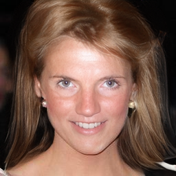 |  |


## Bibtex
- If you find our code useful, please cite our paper:
  ```
  @misc{lu2022inpainting,
      title={Do Inpainting Yourself: Generative Facial Inpainting Guided by Exemplars}, 
      author={Wanglong Lu and Hanli Zhao and Xianta Jiang and Xiaogang Jin and Yongliang Yang and Min Wang and Jiankai Lyu and Kaijie Shi},
      year={2022},
      eprint={2202.06358},
      archivePrefix={arXiv},
      primaryClass={cs.CV}
  }
  ```


## License

Model details and custom CUDA kernel codes are from official repostiories: https://github.com/NVlabs/stylegan2

Codes for Learned Perceptual Image Patch Similarity, LPIPS came from https://github.com/richzhang/PerceptualSimilarity

To match FID scores more closely to tensorflow official implementations, I have used FID Inception V3 implementations in https://github.com/mseitzer/pytorch-fid
