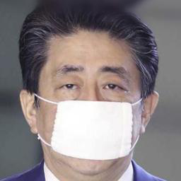
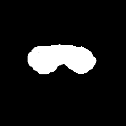
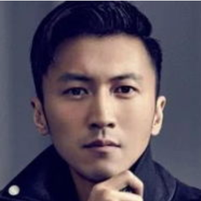
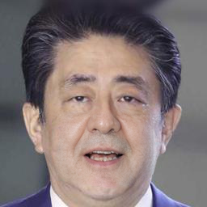
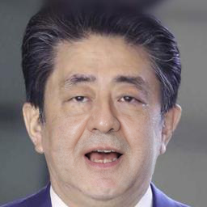

# Do Inpainting Yourself: Generative Facial Inpainting Guided by Exemplars (EXE-GAN)
Official PyTorch implementation of EXE-GAN, publised on [Neurocomputing](https://www.sciencedirect.com/science/article/pii/S0925231224017673?via%3Dihub).

[[Homepage]](https://longlongaaago.github.io/EXE-GAN/)
[[paper]](https://arxiv.org/abs/2202.06358)
[[demo_youtube]](https://www.youtube.com/watch?v=nNEc94hgjtk)
[[demo_bilibili]](https://www.bilibili.com/video/BV14V4y1s7rz/?share_source=copy_web&vd_source=6fb8e0068d30286602ee8ea389f82ce4)
[](https://badges.toozhao.com/stats/01JDD9C9YS7EVK0PN0QB8CJH4Z "Get your own page views count badge on badges.toozhao.com")


<div style="text-align: justify"> We present EXE-GAN, a novel exemplar-guided facial inpainting framework using generative adversarial networks. Our
approach can not only preserve the quality of the input facial image but also complete the image with exemplar-like facial attributes.</div>


## Notice
Our paper has been published in a Neurocomputing Journal!!!  (28 Nov. 2024). 
This paper has been going through a three-year review process!!

Our paper was first released on Sun, 13 Feb 2022. 
We are thankful for the community's recognition and attention to our project.
We also recognized that there have been some great papers published after ours,
and we encourage you to check out their projects as well:
- [Paint by Example](https://arxiv.org/abs/2211.13227), [codes](https://github.com/Fantasy-Studio/Paint-by-Example) (released at Wed, 23 Nov 2022, CVPR 2023)
- [Reference-Guided Face Inpainting](https://arxiv.org/abs/2303.07014), [codes](https://github.com/wuyangluo/reffaceinpainting) (released at Mon, 13 Mar 2023, TCSVT 2023)
- [PATMAT](https://arxiv.org/abs/2304.06107), [codes](https://github.com/humansensinglab/PATMAT) (released at Wed, 12 Apr 2023, ICCV 2023)

## Requirements 
```
cd EXE-GAN project
pip install -r requirements.txt
```
- Note that other versions of PyTorch (e.g., higher than 1.7) also work well, but you have to install the corresponding CUDA version. 

##### What we have released
- [x] Training and testing codes
- [x] Pre-trained models

## Training
- Prepare your dataset (download [FFHQ](https://github.com/NVlabs/ffhq-dataset), and [CelebA-HQ](https://github.com/tkarras/progressive_growing_of_gans))
- The folder structure of training and testing data is shown below:  
```
root/
    test/
        xxx.png
        ...
        xxz.png
    train/
        xxx.png
        ...
        xxz.png
```
- Prepare pre-trained checkpoints:
[Arcface.pth](https://drive.google.com/file/d/18w_YKb0cLX6LAdY4008vEgCPD-_3RmRE/view?usp=drive_link) and 
[psp_ffhq_encode.pt](https://drive.google.com/file/d/1_GdbsT1A5dyxF0FqOEiFlmouVsyf7Ag1/view?usp=drive_link) (put models in ./pre-train)


- Training for 256X256 images
> python train.py --path /root/train --test_path /root/test
--size 256 --embedding_weight 0.1 --id_loss_weight 0.1 --percept_loss_weight 0.5 --arcface_path ./pre-train/Arcface.pth
--psp_checkpoint_path ./pre-train/psp_ffhq_encode.pt

- Training for 512X512 images using larger masks
> python train_largeMask.py --path /root/train --test_path /root/test
--size 256 --embedding_weight 0.1 --id_loss_weight 0.1 --percept_loss_weight 0.5 --arcface_path ./pre-train/Arcface.pth
--psp_checkpoint_path ./pre-train/psp_ffhq_encode.pt

- We found that the previous mask configuration for training 256X256 images is not appropriate for training 512X512 images.
- So we use co-mod gan mask for training, which is plugged in the train_largeMask.py 


## Testing 
#### Notice 
- For editing images from the web, photos should be aligned by face landmarks and cropped to 256x256 by [align_face](https://github.com/ZPdesu/Barbershop/blob/main/align_face.py).

- [Irregular masks](https://nv-adlr.github.io/publication/partialconv-inpainting) (optional, if you would like to test on irregular masks, download Testing Set masks)
- (use our FFHQ_60k pre-trained model [EXE_GAN_model_256.pt](https://drive.google.com/file/d/1y7ThKBXL7QK7CPtvT3KICeNOu1T2xlCA/view?usp=drive_link) and [EXE_GAN_model_512.pt](https://drive.google.com/file/d/1Zq2XrXUQfKBYeRINfZ-_LuxuB5Z-iXdF/view?usp=drive_link) or trained *pt file by yourself.)
> python test.py --path /root/test  --size 256 --psp_checkpoint_path ./pre-train/psp_ffhq_encode.pt --ckpt ./checkpoint/EXE_GAN_model.pt
--mask_root ./dataset/mask/testing_mask_dataset
--mask_file_root ./dataset/mask
--mask_type test_6.txt

```
- mask_root Irregular masks root
- mask_file_root file name list file folder
- mask_type could be ["center", "test_2.txt", "test_3.txt", "test_4.txt", "test_5.txt", "test_6.txt", "all"]
- size 256 for 256X256 images and  512 for  512X512 images
```
- If you don't have irregular masks, just using center masks is also fine.
> python test.py --path /root/test  --size 256 --psp_checkpoint_path ./pre-train/psp_ffhq_encode.pt --ckpt ./checkpoint/EXE_GAN_model.pt
--mask_type center


## Exemplar-guided facial image recovery 
#### Notice 
- For editing images from the web, photos should be aligned by face landmarks and cropped to 256x256 by [align_face](https://github.com/ZPdesu/Barbershop/blob/main/align_face.py).

(use our FFHQ_60k pre-trained model [EXE_GAN_model.pt](https://drive.google.com/file/d/1y7ThKBXL7QK7CPtvT3KICeNOu1T2xlCA/view?usp=drive_link) or trained *pt file by yourself.)
> python guided_recovery.py --psp_checkpoint_path ./pre-train/psp_ffhq_encode.pt
--ckpt  ./checkpoint/EXE_GAN_model.pt  --masked_dir ./imgs/exe_guided_recovery/mask --gt_dir ./imgs/exe_guided_recovery/target --exemplar_dir ./imgs/exe_guided_recovery/exemplar --sample_times 10
> --eval_dir ./recover_out  
```
- masked_dir: mask input folder
- gt_dir: the input gt_dir, used for  editing 
- exemplar_dir: exemplar_dir, the exemplar dir, for guiding the editing
- eval_dir: output dir
```
|  |  |  | |
| :----------------------------------------------------------: | :----------------------------------------------------------: | :----------------------------------------------------------: |:----------------------------------------------------------: |
|  |  |  | |
|  |  |  | |
|  |  |  | |
|          Ground-truth                        |                      Mask                               | Exemplar       | Inpainted  | 

- Inherent diversity, set ``--sample_times 10``  higher to get more diverse results.

|  |  |  | |
| :----------------------------------------------------------: | :----------------------------------------------------------: | :----------------------------------------------------------: |:----------------------------------------------------------: |
|          diversity 1                       |                      diversity 2                               | diversity 3       | diversity 4  | 


## Exemplar guided style mixing 
#### Notice 
- For editing images from the web, photos should be aligned by face landmarks and cropped to 256x256 by [align_face](https://github.com/ZPdesu/Barbershop/blob/main/align_face.py).

(use our FFHQ_60k pre-trained model [EXE_GAN_model.pt](https://drive.google.com/file/d/1y7ThKBXL7QK7CPtvT3KICeNOu1T2xlCA/view?usp=drive_link) or trained *pt file by yourself.)
> python exemplar_style_mixing.py --psp_checkpoint_path ./pre-train/psp_ffhq_encode.pt
--ckpt  ./checkpoint/EXE_GAN_model.pt  --masked_dir ./imgs/exe_guided_recovery/mask --gt_dir ./imgs/exe_guided_recovery/target --exemplar_dir ./imgs/exe_guided_recovery/exemplar --sample_times 2
> --eval_dir mixing_out  

```
- masked_dir: mask input folder
- gt_dir: the input gt_dir, used for  editing 
- exemplar_dir: exemplar_dir, the exemplar dir, for guiding the editing
- eval_dir: output dir
- size 256 for 256X256 images and  512 for  512X512 images
```
- Inputs are shown below:

|  |  |  | |
| :----------------------------------------------------------: | :----------------------------------------------------------: | :----------------------------------------------------------: |:----------------------------------------------------------: |
|         Ground-truth                      |                      Mask                              | Exemplar 1       | Exemplar 2  | 

- Style mixing results

|  |  |  | |
| :----------------------------------------------------------: | :----------------------------------------------------------: | :----------------------------------------------------------: |:----------------------------------------------------------: |
|  |  |  | |
|  |  |  | |
|  |  |  | |


## Editing masks by yourself 


We also uploaded the mask editing tool. 
You can try this tool to generate your masks for editing.
> python mask_gui.py


## Bibtex
- If you find our code useful, please cite our paper:
  ```
  @article{LU2025128996,
    title = {Do inpainting yourself: Generative facial inpainting guided by exemplars},
    journal = {Neurocomputing},
    volume = {617},
    pages = {128996},
    year = {2025},
    issn = {0925-2312},
    doi = {https://doi.org/10.1016/j.neucom.2024.128996},
    url = {https://www.sciencedirect.com/science/article/pii/S0925231224017673},
    author = {Wanglong Lu and Hanli Zhao and Xianta Jiang and Xiaogang Jin and Yong-Liang Yang and Kaijie Shi},
    keywords = {Generative adversarial networks, Image generation, Image inpainting, Facial image inpainting},
    }
  
  @ARTICLE{FACEMUG,
    author={Lu, Wanglong and Wang, Jikai and Jin, Xiaogang and Jiang, Xianta and Zhao, Hanli},
    journal={IEEE Transactions on Visualization and Computer Graphics}, 
    title={FACEMUG: A Multimodal Generative and Fusion Framework for Local Facial Editing}, 
    year={2024},
    volume={},
    number={},
    pages={1-15},
    keywords={Facial features;Semantics;Codes;Generators;Image synthesis;Faces;Image color analysis;Generative adversarial networks;image-toimage translation;multimodal fusion;image editing;facial editing},
    doi={10.1109/TVCG.2024.3434386}}
  ```


## Acknowledgements

Model details and custom CUDA kernel codes are from official repositories: https://github.com/NVlabs/stylegan2

Codes for Learned Perceptual Image Patch Similarity, LPIPS came from https://github.com/richzhang/PerceptualSimilarity

To match FID scores more closely to tensorflow official implementations, I have used FID Inception V3 implementations in https://github.com/mseitzer/pytorch-fid
